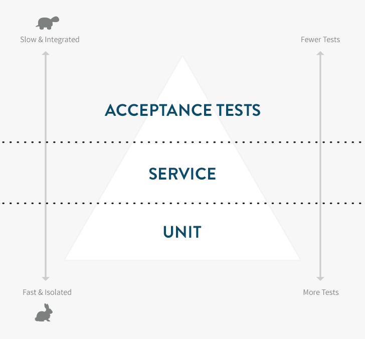

## Different types of tests
* Unit
* Integration
* Acceptance

### Unit Tests
* i.e. testing seperate classes independently

### Integration Tests
* Testing that Units communicate with each other properly and produce expected results.
* Take longer than Unit tests.

### Acceptance Tests
* Emulate client actions and test whether the app behaves the way the client expects it to behave.
* Take longer than Integration tests.

### The test pyramid

[The Rails Testing Pyramid](http://blog.codeclimate.com/blog/2013/10/09/rails-testing-pyramid/)

* The foundation of our app is tested by fast, isolated Unit Tests
* The service layer integrates units to create different features, this is where we write Integration Tests.
* At the top, we need to test a small number of critical user paths via Acceptance Tests.

### Outside-In Approach
* Start by writing Acceptance Tests
  * This forces us to go deeper into integration and unit levels.

### Workflow Cycle (Red - Green - Refactor)