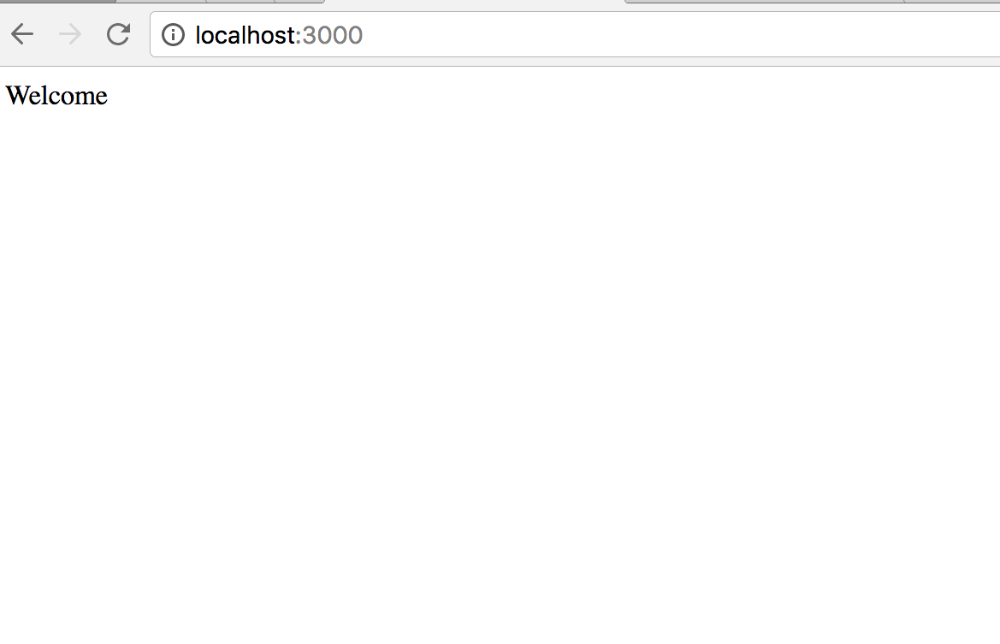
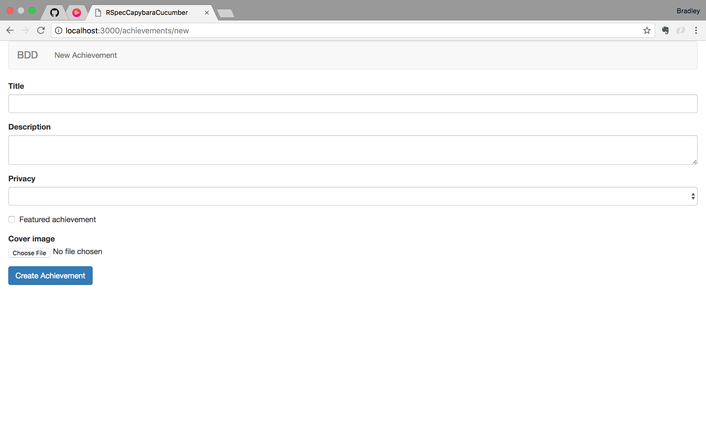
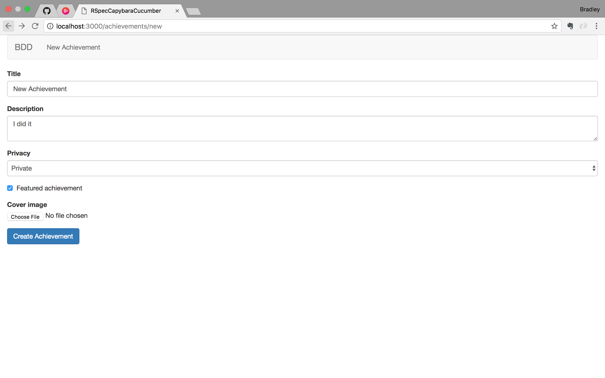
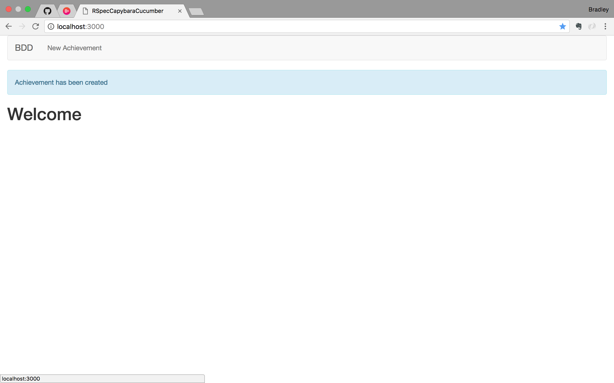
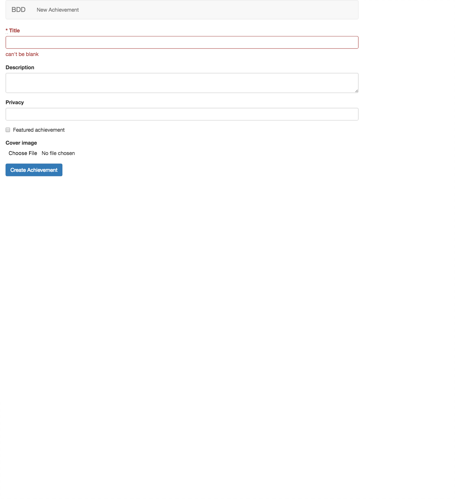
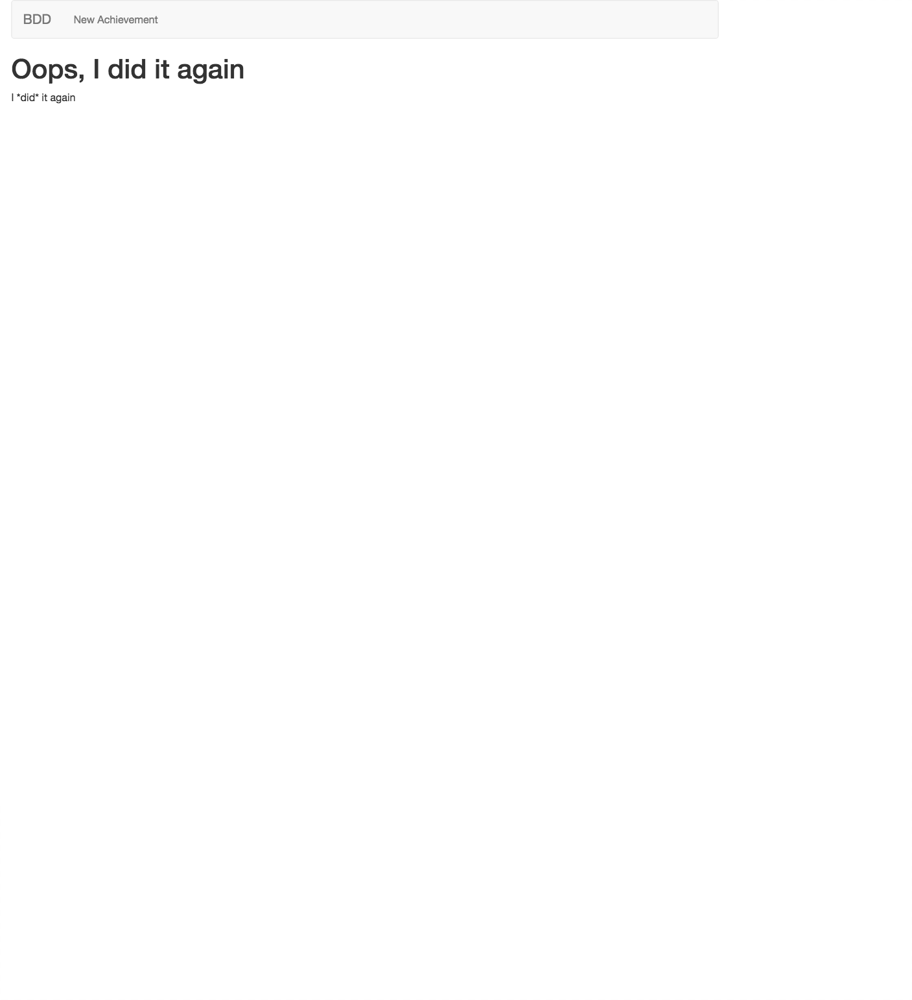
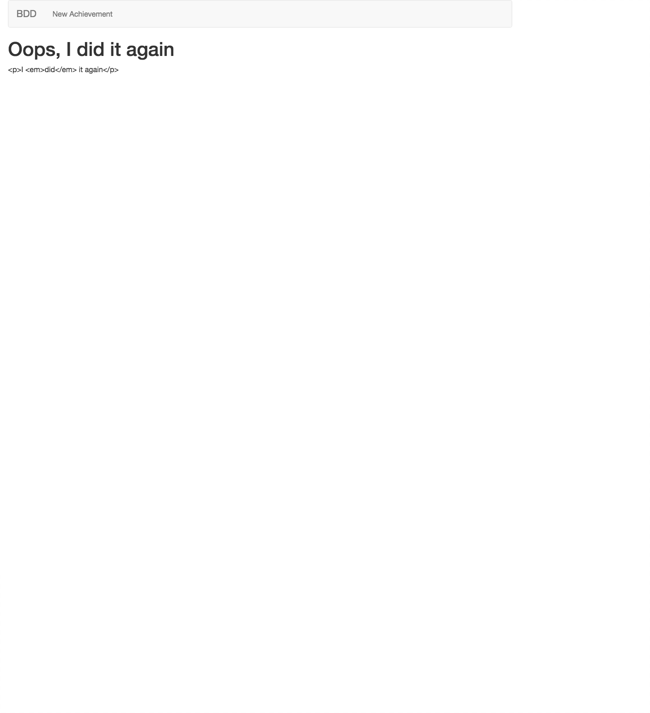

# Acceptance Tests
## Overview
* Rails app setup
* Capybara helpers
* Page Object pattern
* Factory Girl
* Cucumber 101


### Setup and simple welcome page

_Gemfile_
```ruby
source 'https://rubygems.org'

git_source(:github) do |repo_name|
  repo_name = "#{repo_name}/#{repo_name}" unless repo_name.include?("/")
  "https://github.com/#{repo_name}.git"
end

gem 'rails', '~> 5.0.1'
gem 'sqlite3'
gem 'puma', '~> 3.0'
gem 'sass-rails', '~> 5.0'
gem 'uglifier', '>= 1.3.0'
gem 'coffee-rails', '~> 4.2'
gem 'jquery-rails'
gem 'turbolinks', '~> 5'
gem 'jbuilder', '~> 2.5'
gem 'bootstrap-sass'

group :development, :test do
  gem 'byebug', platform: :mri
  gem 'rspec-rails'
  gem 'factory_girl_rails'
end

group :test do
  gem 'capybara'
end

group :development do
  gem 'web-console', '>= 3.3.0'
  gem 'listen', '~> 3.0.5'
  gem 'spring'
  gem 'spring-commands-rspec'
  gem 'spring-watcher-listen', '~> 2.0.0'
end

gem 'tzinfo-data', platforms: [:mingw, :mswin, :x64_mingw, :jruby]


```

Run bundle.
```
$ bundle
```

Generate some files
```
$ rails g rspec:install
Running via Spring preloader in process 4223
Expected string default value for '--jbuilder'; got true (boolean)
      create  .rspec
      create  spec
      create  spec/spec_helper.rb
      create  spec/rails_helper.rb
```

```
$ bundle exec spring binstub --all
* bin/rake: spring already present
* bin/rspec: generated with spring
* bin/rails: spring already present
```

Create Folder: _/spec/features_

Create File: _/spec/features/home_page_spec.rb_
```ruby
require 'rails_helper'

feature 'home page' do
  scenario 'welcome message' do
    visit('/')
    expect(page).to have_content('Welcome')
  end
end
```

#### Red

Spec Fails: (abridged text here, what's important is the failure message)
```
$ rspec

home page
  welcome message (FAILED - 1)

Failures:

  1) home page welcome message
     Failure/Error: visit('/')

     ActionController::RoutingError:
       No route matches [GET] "/"
```

#### Green
_/config/routes.rb_
```ruby
Rails.application.routes.draw do
  root to: 'welcome#index'
end
```
```
$ rspec

home page
  welcome message (FAILED - 1)

Failures:

  1) home page welcome message
     Failure/Error: visit('/')

     ActionController::RoutingError:
       uninitialized constant WelcomeController
```

We need WelcomeController

Create:
_/app/controllers/welcome_controller.rb_
```ruby
class WelcomeController < ApplicationController
  
end
```
```
$ rspec

home page
  welcome message (FAILED - 1)

Failures:

  1) home page welcome message
     Failure/Error: visit('/')

     AbstractController::ActionNotFound:
       The action 'index' could not be found for WelcomeController
```

We need action 'index'

_/app/controllers/welcome_controller.rb_
```ruby
class WelcomeController < ApplicationController
  def index
  end
end
```
```
$ rspec

home page
  welcome message (FAILED - 1)

Failures:

  1) home page welcome message
     Failure/Error: visit('/')

     ActionController::UnknownFormat:
       WelcomeController#index is missing a template for this request format and variant.
```

We're missing a template. Create: _/app/views/welcome/index.html.erb_

```
$ rspec

home page
  welcome message (FAILED - 1)

Failures:

  1) home page welcome message
     Failure/Error: expect(page).to have_content('Welcome')
       expected to find text "Welcome" in ""
     # ./spec/features/home_page_spec.rb:6:in `block (2 levels) in <top (required)>'

Finished in 0.3308 seconds (files took 3.56 seconds to load)
1 example, 1 failure
```

Add welcome text:
_/app/views/welcome/index.html.erb_
```
Welcome
```
```
$ rspec

home page
  welcome message

Finished in 0.18298 seconds (files took 3.51 seconds to load)
1 example, 0 failures
```

We can visually verify:
```
$ rails s
```
http://localhost:3000/


### Bootstrap Styling

Create File: _/app/assets/stylesheets/main.css.scss_
```css
@import 'bootstrap-sprockets';
@import 'bootstrap';
```

Add and commit:

### A Feature Spec

Create File: _/spec/features/create_achievement_spec.rb_
```ruby
require 'rails_helper'

feature 'create new achievement' do
  scenario 'create new achievement with valid data' do
    visit('/')
    click_on('New Achievement')

    fill_in('Title', with: 'Worked out today')
    fill_in('Description', with: 'Crushed abs and cardio')
    select('Public', from: 'Privacy')
    check('Featured achievement')
    attach_file('Cover image', "#{Rails.root}/spec/fixtures/cover_image.png")
    click_on('Create Achievement')

    expect(page).to have_content('Achievement has been created')
    expect(Achievement.last.title).to eq('Worked out today')
  end
end
```
```
$ rspec
Unable to find link or button "New Achievement"
```

Add a simple Bootstrapped navbar with link to new achievement path.

_/app/views/layouts/application.html.erb_
```ruby
<!DOCTYPE html>
<html>
<head>
  <title>RSpecCapybaraCucumber</title>
  <%= csrf_meta_tags %>

  <%= stylesheet_link_tag    'application', media: 'all', 'data-turbolinks-track': 'reload' %>
  <%= javascript_include_tag 'application', 'data-turbolinks-track': 'reload' %>
</head>

<body>
  <div class="container-fluid">   
    <nav class="navbar navbar-default" role="navigation">
      <!-- Brand and toggle get grouped for better mobile display -->
      <div class="navbar-header">
        <button type="button" class="navbar-toggle" data-toggle="collapse" data-target=".navbar-ex1-collapse">
          <span class="sr-only">Toggle navigation</span>
          <span class="icon-bar"></span>
          <span class="icon-bar"></span>
          <span class="icon-bar"></span>
        </button>
        <a class="navbar-brand" href="/">BDD</a>
      </div>

      <!-- Collect the nav links, forms, and other content for toggling -->
      <div class="collapse navbar-collapse navbar-ex1-collapse">
        <ul class="nav navbar-nav">
          <li><%= link_to 'New Achievement', new_achievement_path %></li>
        </ul>
      </div><!-- /.navbar-collapse -->
    </nav>

    <%= yield %>    
  </div>
</body>
</html>
```
```
$ rspec
undefined local variable or method `new_achievement_path' for #<#<Class:0x007fabd909b988>:0x007fabd7ed92e0>
```

_/config/routes.rb_
```ruby
Rails.application.routes.draw do
  resources :achievements, only: [ :new, :create ]
  root to: 'welcome#index'
end
```
``` 
$ rspec
ActionController::RoutingError:
       uninitialized constant AchievementController
```

Create File: _/app/controllers/achievements_controller.rb_
```ruby
class AchievementsController < ApplicationController

end
```
```
$ rspec
AbstractController::ActionNotFound:
       The action 'new' could not be found for AchievementsController
```

_/app/controllers/achievements_controller.rb_
```ruby
class AchievementsController < ApplicationController
  def new
  end
end
```
```
$ rspec
ActionController::UnknownFormat:
       AchievementsController#new is missing a template for this request format and variant.
```

Create Template: _/app/views/achievements/new.html.erb_

```
$ rspec
Capybara::ElementNotFound:
       Unable to find field "Title"
```

Now we can't find the field "Title", and to have a form we need to have a model.

_/app/views/achievements/new.html.erb_
```ruby
<%= form_for @achievement do |f| %>

<% end %>
```
```
$ rspec
ActionView::Template::Error:
       First argument in form cannot contain nil or be empty
```

_/app/controllers/achievements_controller.rb_
```ruby
class AchievementsController < ApplicationController
  def new
    @achievement = Achievement.new
  end
end
```
```
$ rspec
NameError:
       uninitialized constant AchievementsController::Achievement
```

```
$ rails g model achievement title description:text privacy:integer featured:boolean cover_image
Running via Spring preloader in process 7043
Expected string default value for '--jbuilder'; got true (boolean)
      invoke  active_record
      create    db/migrate/20170208201655_create_achievements.rb
      create    app/models/achievement.rb
      invoke    rspec
      create      spec/models/achievement_spec.rb
      invoke      factory_girl
      create        spec/factories/achievements.rb
```
```
$ rails db:migrate
== 20170208201655 CreateAchievements: migrating ===============================
-- create_table(:achievements)
   -> 0.0014s
== 20170208201655 CreateAchievements: migrated (0.0015s) ======================
```
```
$ rails g simple_form:install --bootstrap
Running via Spring preloader in process 7245
Expected string default value for '--jbuilder'; got true (boolean)
      create  config/initializers/simple_form.rb
      create  config/initializers/simple_form_bootstrap.rb
       exist  config/locales
      create  config/locales/simple_form.en.yml
      create  lib/templates/erb/scaffold/_form.html.erb
```
```
$ rspec

Failures:

  1) create new achievement create new achievement with valid data
     Failure/Error: fill_in('Title', with: 'Worked out today')

     Capybara::ElementNotFound:
       Unable to find field "Title"
```

_/app/views/achievements/new.html.erb_
```ruby
<%= simple_form_for @achievement do |f| %>
  <%= f.input :title %>
<% end %>
```
```
$ rspec

Failures:

  1) create new achievement create new achievement with valid data
     Failure/Error: fill_in('Description', with: 'Crushed abs and cardio')

     Capybara::ElementNotFound:
       Unable to find field "Description"
```

_/app/views/achievements/new.html.erb_
```ruby
<%= simple_form_for @achievement do |f| %>
  <%= f.input :title %>
  <%= f.input :description %>
<% end %>
```
```
$ rspec

Failures:

  1) create new achievement create new achievement with valid data
     Failure/Error: select('Public', from: 'Privacy')

     Capybara::ElementNotFound:
       Unable to find select box "Privacy"
```

_/app/views/achievements/new.html.erb_
```ruby
<%= simple_form_for @achievement do |f| %>
  <%= f.input :title %>
  <%= f.input :description %>
  <%= f.input :privacy, collection: Achievement.privacies %>
<% end %>
```
```
$ rspec

Failures:

  1) create new achievement create new achievement with valid data
     Failure/Error: <%= f.input :privacy, collection: Achievement.privacies %>

     ActionView::Template::Error:
       undefined method `privacies' for #<Class:0x007fa62523df70>
```

_/app/models/achievement.rb_
```ruby
class Achievement < ApplicationRecord
  enum privacy: [ :public_access, :private_access, :friends_access ]
end
```
```
$ rspec

Failures:

  1) create new achievement create new achievement with valid data
     Failure/Error: select('Public', from: 'Privacy')

     Capybara::ElementNotFound:
       Unable to find option "Public"
```

What's happening here is that from the actual page view on http://localhost:3000/achievements/new we're not seeing a capitalized "Public" option.

_/app/views/achievements/new.html.erb_
```ruby
<%= simple_form_for @achievement do |f| %>
  <%= f.input :title %>
  <%= f.input :description %>
  <%= f.input :privacy, collection: Hash[Achievement.privacies.map { |k,v| [ k.split('_').first.capitalize, k ]}] %>
<% end %>
```
```
$ rspec

Failures:

  1) create new achievement create new achievement with valid data
     Failure/Error: check('Featured achievement')

     Capybara::ElementNotFound:
       Unable to find checkbox "Featured achievement"
```

_/app/views/achievements/new.html.erb_
```ruby
<%= simple_form_for @achievement do |f| %>
  <%= f.input :title %>
  <%= f.input :description %>
  <%= f.input :privacy, collection: Hash[Achievement.privacies.map { |k,v| [ k.split('_').first.capitalize, k ]}] %>
  <%= f.input :featured, label: 'Featured achievement' %>
<% end %>
```
```
$ rspec

Failures:

  1) create new achievement create new achievement with valid data
     Failure/Error: attach_file('Cover image', "#{Rails.root}/spec/fixtures/cover_image.png")

     Capybara::FileNotFound:
       cannot attach file, /Users/bradleybiehl/Code/RSpec_Capybara_Cucumber/spec/fixtures/cover_image.png does not exist
```

```
$ mkdir spec/fixtures
```

Copy/Paste cover_image.png to new folder.

```
$ rspec

Failures:

  1) create new achievement create new achievement with valid data
     Failure/Error: attach_file('Cover image', "#{Rails.root}/spec/fixtures/cover_image.png")

     Capybara::ElementNotFound:
       Unable to find file field "Cover image"
```

_/app/views/achievements/new.html.erb_
```ruby
<%= simple_form_for @achievement do |f| %>
  <%= f.input :title %>
  <%= f.input :description %>
  <%= f.input :privacy, collection: Hash[Achievement.privacies.map { |k,v| [ k.split('_').first.capitalize, k ]}] %>
  <%= f.input :featured, label: 'Featured achievement' %>
  <%= f.input :cover_image, as: :file %>
<% end %>
```
```
$ rspec

Failures:

  1) create new achievement create new achievement with valid data
     Failure/Error: click_on('Create Achievement')

     Capybara::ElementNotFound:
       Unable to find link or button "Create Achievement"
```

_/app/views/achievements/new.html.erb_
```ruby
<%= simple_form_for @achievement do |f| %>
  <%= f.input :title %>
  <%= f.input :description %>
  <%= f.input :privacy, collection: Hash[Achievement.privacies.map { |k,v| [ k.split('_').first.capitalize, k ]}] %>
  <%= f.input :featured, label: 'Featured achievement' %>
  <%= f.input :cover_image, as: :file %>

  <%= f.submit 'Create Achievement', class: 'btn btn-primary' %>
<% end %>
```
```
$ rspec

Failures:

  1) create new achievement create new achievement with valid data
     Failure/Error: click_on('Create Achievement')

     AbstractController::ActionNotFound:
       The action 'create' could not be found for AchievementsController
```



_/app/controllers/achievements_controller.rb_
```ruby
class AchievementsController < ApplicationController
  def new
    @achievement = Achievement.new
  end

  def create
    @achievement = Achievement.new(achievement_params)
    if @achievement.save
      redirect_to root_url, notice: 'Achievement has been created'
    end
  end

  private

  def achievement_params
    params.require(:achievement).permit(:title, :description, :privacy, :cover_image, :featured)
  end
end
```
```
$ rspec

Failures:

  1) create new achievement create new achievement with valid data
     Failure/Error: expect(page).to have_content('Achievement has been created')
       expected to find text "Achievement has been created" in "Toggle navigation BDD New Achievement Welcome"
```

_/app/views/application.html.erb_
```ruby
<!DOCTYPE html>
<html>
<head>
  <title>RSpecCapybaraCucumber</title>
  <%= csrf_meta_tags %>

  <%= stylesheet_link_tag    'application', media: 'all', 'data-turbolinks-track': 'reload' %>
  <%= javascript_include_tag 'application', 'data-turbolinks-track': 'reload' %>
</head>

<body>
  <div class="container-fluid">   
    <nav class="navbar navbar-default" role="navigation">
      <!-- Brand and toggle get grouped for better mobile display -->
      <div class="navbar-header">
        <button type="button" class="navbar-toggle" data-toggle="collapse" data-target=".navbar-ex1-collapse">
          <span class="sr-only">Toggle navigation</span>
          <span class="icon-bar"></span>
          <span class="icon-bar"></span>
          <span class="icon-bar"></span>
        </button>
        <a class="navbar-brand" href="/">BDD</a>
      </div>

      <!-- Collect the nav links, forms, and other content for toggling -->
      <div class="collapse navbar-collapse navbar-ex1-collapse">
        <ul class="nav navbar-nav">
          <li><%= link_to 'New Achievement', new_achievement_path %></li>
        </ul>
      </div><!-- /.navbar-collapse -->
    </nav>

    <% if flash[:notice] %>
      <div class="alert alert-info"><%= flash[:notice] %></div>
    <% end %>

    <%= yield %>    
  </div>
</body>
</html>
```
```
$ rspec spec/features/create_achievement_spec.rb

create new achievement
  create new achievement with valid data

Finished in 0.31256 seconds (files took 1.72 seconds to load)
1 example, 0 failures
```




```
$ rails c
Running via Spring preloader in process 8236
Loading development environment (Rails 5.0.1)
Cannot read termcap database;
using dumb terminal settings.
2.3.1 :001 > Achievement.last
  Achievement Load (0.2ms)  SELECT  "achievements".* FROM "achievements" ORDER BY "achievements"."id" DESC LIMIT ?  [["LIMIT", 1]]
 => #<Achievement id: 1, title: "New Achievement", description: "I did it", privacy: "private_access", featured: true, cover_image: nil, created_at: "2017-02-08 21:09:46", updated_at: "2017-02-08 21:09:46">
2.3.1 :002 >
```

```
$ git add .
$ git commit -m "first spec passes"
```

---

### Testing Validation

_/spec/features/create_achievememt_spec.rb_
```ruby
require 'rails_helper'

feature 'create new achievement' do

  .
  .
  .

  scenario 'cannot create new achievement with invalid data' do
    visit('/')
    click_on('New Achievement')

    click_on('Create Achievement')

    expect(page).to have_content("Can't Be Blank!")
  end
end
```
```
$ rspec

Failures:

  1) create new achievement cannot create new achievement with invalid data
     Failure/Error: expect(page).to have_content("Can't Be Blank!")
       expected to find text "Can't Be Blank!" in "Toggle navigation BDD New Achievement Achievement has been created Welcome"
```

_/app/models/achievement.rb_
```ruby
class Achievement < ApplicationRecord
  validates :title, presence: true

  enum privacy: [ :public_access, :private_access, :friends_access ]
end
```
```
$ rspec

Failures:

  1) create new achievement cannot create new achievement with invalid data
     Failure/Error: expect(page).to have_content("Can't Be Blank!")

     Capybara::ElementNotFound:
       Unable to find xpath "/html"
```

_/app/controllers/achievements_controller.rb_
```ruby
class AchievementsController < ApplicationController
  def new
    @achievement = Achievement.new
  end

  def create
    @achievement = Achievement.new(achievement_params)
    if @achievement.save
      redirect_to root_url, notice: 'Achievement has been created'
    else
      render :new
    end
  end

  private

  def achievement_params
    params.require(:achievement).permit(:title, :description, :privacy, :cover_image, :featured)
  end
end
```
```
$ rspec

create new achievement
  create new achievement with valid data
  cannot create new achievement with invalid data

home page
  welcome message

Finished in 0.39055 seconds (files took 1.7 seconds to load)
3 examples, 0 failures
```


---

### Page Object Pattern
> Refactoring what we just did.

#### Create a support spec that includes Capybara helper methods.

```
$ mkdir spec/support
```

_/spec/support/new_achievement_form.rb_
```ruby
class NewAchievementForm
  include Capybara::DSL

  def visit_page
    visit('/')
    click_on('New Achievement')
    self
  end

  def fill_in_with(params = {})
    fill_in('Title', with: params.fetch(:title, 'Worked out today'))
    fill_in('Description', with: 'Crushed abs and cardio')
    select('Public', from: 'Privacy')
    check('Featured achievement')
    attach_file('Cover image', "#{Rails.root}/spec/fixtures/cover_image.png")

    self
  end

  def submit
    click_on('Create Achievement')
    self    
  end
end
```

#### Refactor Specs:
_/spec/features/create_achievement_spec.rb_
```ruby
require 'rails_helper'
require_relative '../support/new_achievement_form'

feature 'create new achievement' do
  let(:new_achievement_form) {NewAchievementForm.new}

  scenario 'create new achievement with valid data' do
    new_achievement_form.visit_page.fill_in_with(
      title: 'Worked out today'
      ).submit

    expect(page).to have_content('Achievement has been created')
    expect(Achievement.last.title).to eq('Worked out today')
  end

  scenario 'cannot create new achievement with invalid data' do
    new_achievement_form.visit_page.submit

    expect(page).to have_content("can't be blank")
  end
end
```
```
$ rspec

create new achievement
  create new achievement with valid data
  cannot create new achievement with invalid data

home page
  welcome message

Finished in 0.39953 seconds (files took 1.71 seconds to load)
3 examples, 0 failures
```

---

### Factory Girl
> Prepare data for tests.

#### Create new spec for the achievement page, testing against title.
_/spec/features/achievement_page_spec.rb_
```ruby
require 'rails_helper'

feature 'Achievement Page' do
  scenario 'Achievement Public Page' do
    achievement = Achievement.create(title: 'just did it')
    visit("/achievements/#{achievement.id}")

    expect(page).to have_content('just did it')
  end
end
```
```
$ rspec

Failures:

  1) Achievement Page Achievement Public Page
     Failure/Error: visit("/achievements/#{achievement.id}")

     ActionController::RoutingError:
       No route matches [GET] "/achievements/1"
```

_/config/routes.rb_
```ruby
Rails.application.routes.draw do
  resources :achievements, only: [ :new, :create, :show ]
  root to: 'welcome#index'
end
```
```
$ rspec

Failures:

  1) Achievement Page Achievement Public Page
     Failure/Error: visit("/achievements/#{achievement.id}")

     AbstractController::ActionNotFound:
       The action 'show' could not be found for AchievementsController
```

_/app/controllers/achievements_controller.rb_
```ruby
class AchievementsController < ApplicationController

  .
  .
  .

  def show  
  end

  private

  .
  .
  .

end
```
```
$ rspec

Failures:

  1) Achievement Page Achievement Public Page
     Failure/Error: visit("/achievements/#{achievement.id}")

     ActionController::UnknownFormat:
       AchievementsController#show is missing a template for this request format and variant.
```

#### Create File:

_/app/views/achievements/show.html.erb_

```
$ rspec
 Failures:

  1) Achievement Page Achievement Public Page
     Failure/Error: expect(page).to have_content('just did it')
       expected to find text "just did it" in "Toggle navigation BDD New Achievement"
```

_/app/views/achievements/show.html.erb_
```ruby
<h1><%= @achievement.title %></h1>
```
```
$ rspec

Failures:

  1) Achievement Page Achievement Public Page
     Failure/Error: expect(page).to have_content('just did it')
       expected to find text "just did it" in "Toggle navigation BDD New Achievement"
```

_/app/controllers/achievements_controller.rb_
```ruby
class AchievementsController < ApplicationController

  .
  .
  .

  def show
    @achievement = Achievement.find(params[:id])
  end

  private

  .
  .
  .

end
```
``` 
$ rspec

Achievement Page
  Achievement Public Page

create new achievement
  create new achievement with valid data
  cannot create new achievement with invalid data

home page
  welcome message

Finished in 0.41951 seconds (files took 1.72 seconds to load)
4 examples, 0 failures
```

#### Testing against description using factories.

_/spec/features/achievement_page_spec.rb_
```ruby
require 'rails_helper'

feature 'Achievement Page' do
  scenario 'Achievement Public Page' do
    achievement = FactoryGirl.create(:achievement)
    visit("/achievements/#{achievement.id}")

    expect(page).to have_content('just did it')
  end

  scenario 'Render Markdown Description' do
    achievement = Achievement.create!(title: 'title', description: 'it was *cool*')
    visit("/achievements/#{achievement.id}")

    expect(page).to have_content('it was <i>cool</i>')
  end
end
```

_/spec/factories/achievements.rb_
```ruby
FactoryGirl.define do
  factory :achievement do
    title "Title"
    description "Description"
    privacy Achievement.privacies[:private_access]
    featured false
    cover_image "some_image.png"
  end
end
```
```
$ rspec

Failures:

  1) Achievement Page Achievement Public Page
     Failure/Error: expect(page).to have_content('just did it')
       expected to find text "just did it" in "Toggle navigation BDD New Achievement Title"

  2) Achievement Page Render Markdown Description
     Failure/Error: expect(page).to have_content('it was <i>cool</i>')
       expected to find text "it was <i>cool</i>" in "Toggle navigation BDD New Achievement title"
```
_/app/views/achievements/show.html.erb_
```ruby
<h1><%= @achievement.title %></h1>
<p><%= @achievement.description %></p>
```

> Markdown is not translating to an example achievement

http://localhost:3000/achievements/3 


_/spec/features/achievement_page_spec.rb_
```ruby
require 'rails_helper'

feature 'Achievement Page' do
  scenario 'Achievement Public Page' do
    achievement = FactoryGirl.create(:achievement, title: 'just did it')
    visit("/achievements/#{achievement.id}")

    expect(page).to have_content('just did it')
  end

  scenario 'Render Markdown Description' do
    achievement = FactoryGirl.create(:achievement, description: 'it was cool')
    visit("/achievements/#{achievement.id}")

    expect(page).to have_content('it was cool')
  end
end
```
```
$ rspec

Achievement Page
  Achievement Public Page
  Render Markdown Description

create new achievement
  create new achievement with valid data
  cannot create new achievement with invalid data

home page
  welcome message

Finished in 0.43688 seconds (files took 1.69 seconds to load)
5 examples, 0 failures
```

#### Defining Subfactories and Sequences in FactoryGirl
_/spec/factories/achievements.rb_
```ruby
FactoryGirl.define do
  factory :achievement do
    sequence(:title) { |n| "Achievement #{n}"}
    description "description"
    privacy Achievement.privacies[:private_access]
    featured false
    cover_image "some_image.png"

    factory :public_achievement do
      privacy Achievement.privacies[:public_access]
    end
  end
end
```

_/spec/achievement_page_spec.rb_
```ruby
require 'rails_helper'

feature 'Achievement Page' do
  scenario 'Achievement Public Page' do
    achievement = FactoryGirl.create(:achievement, title: 'just did it')
    visit("/achievements/#{achievement.id}")

    expect(page).to have_content('just did it')

    achievements = FactoryGirl.create_list(:achievement, 3)
    p achievements
  end

  scenario 'Render Markdown Description' do
    achievement = FactoryGirl.create(:achievement, description: 'it was cool')
    visit("/achievements/#{achievement.id}")

    expect(page).to have_content('it was cool')
  end
end
```
```
$ rspec

Achievement Page
[#<Achievement id: 2, title: "Achievement 1", description: "description", privacy: "private_access", featured: false, cover_image: "some_image.png", created_at: "2017-02-09 15:34:26", updated_at: "2017-02-09 15:34:26">, #<Achievement id: 3, title: "Achievement 2", description: "description", privacy: "private_access", featured: false, cover_image: "some_image.png", created_at: "2017-02-09 15:34:26", updated_at: "2017-02-09 15:34:26">, #<Achievement id: 4, title: "Achievement 3", description: "description", privacy: "private_access", featured: false, cover_image: "some_image.png", created_at: "2017-02-09 15:34:26", updated_at: "2017-02-09 15:34:26">]
  Achievement Public Page
  Render Markdown Description

create new achievement
  create new achievement with valid data
  cannot create new achievement with invalid data

home page
  welcome message

Finished in 0.43592 seconds (files took 2.05 seconds to load)
5 examples, 0 failures
```

#### Back to Testing Markdown

_/spec/achievement_page_spec.rb_
```ruby
require 'rails_helper'

feature 'Achievement Page' do
  scenario 'Achievement Public Page' do
    achievement = FactoryGirl.create(:achievement, title: 'just did it')
    visit("/achievements/#{achievement.id}")

    expect(page).to have_content('just did it')
  end

  scenario 'Render Markdown Description' do
    achievement = FactoryGirl.create(:achievement, description: 'it was *cool*')
    visit("/achievements/#{achievement.id}")

    expect(page).to have_content('it was <em>cool</em>')
  end
end
```

In _Gemfile_, add `gem 'redcarpet'`

```
$ bundle
.
.
.
Installing redcarpet 3.4.0 with native extensions
Bundle complete! 22 Gemfile dependencies, 79 gems now installed.
Use `bundle show [gemname]` to see where a bundled gem is installed.
```

_/app/controllers/achievements_controller.rb_
```ruby
class AchievementsController < ApplicationController
  .
  .
  .

  def show
    @achievement = Achievement.find(params[:id])
    @description = Redcarpet::Markdown.new(Redcarpet::Render::HTML).render(@achievement.description)
  end

  private

  .
  .
  .
end
```

_/app/views/achievements/show.html.erb_
```ruby
<h1><%= @achievement.title %></h1>
<p><%= @description %></p>
```
```
$ rspec

Achievement Page
  Achievement Public Page
  Render Markdown Description

create new achievement
  create new achievement with valid data
  cannot create new achievement with invalid data

home page
  welcome message

Finished in 0.43844 seconds (files took 1.78 seconds to load)
5 examples, 0 failures
```

But taking a look at the browser:


_/app/views/achievements/show.html.erb_
```ruby
<h1><%= @achievement.title %></h1>
<div><%= @description.html_safe %></div>
```


#### But, we now need to find the CSS:
```
$ rspec

Failures:

  1) Achievement Page Render Markdown Description
     Failure/Error: expect(page).to have_content('it was <em>cool</em>')
       expected to find text "it was <em>cool</em>" in "Toggle navigation BDD New Achievement Achievement 1 it was cool"
```

_/spec/achievement_page_spec.rb_
```ruby
require 'rails_helper'

feature 'Achievement Page' do
  scenario 'Achievement Public Page' do
    achievement = FactoryGirl.create(:achievement, title: 'just did it')
    visit("/achievements/#{achievement.id}")

    expect(page).to have_content('just did it')
  end

  scenario 'Render Markdown Description' do
    achievement = FactoryGirl.create(:achievement, description: 'it was *cool*')
    visit("/achievements/#{achievement.id}")

    expect(page).to have_css('em', text: 'cool')
  end
end
```
```
$ rspec

Achievement Page
  Achievement Public Page
  Render Markdown Description

create new achievement
  create new achievement with valid data
  cannot create new achievement with invalid data

home page
  welcome message

Finished in 0.48758 seconds (files took 2.37 seconds to load)
5 examples, 0 failures
```

---

### Cucumber
> Tool for writing automated tests in plain language, so non-tech clients can create specs with us.

#### Setup Cucumber

Update _Gemfile_
```ruby
source 'https://rubygems.org'

git_source(:github) do |repo_name|
  repo_name = "#{repo_name}/#{repo_name}" unless repo_name.include?("/")
  "https://github.com/#{repo_name}.git"
end

gem 'rails', '~> 5.0.1'
gem 'sqlite3'
gem 'puma', '~> 3.0'
gem 'sass-rails', '~> 5.0'
gem 'uglifier', '>= 1.3.0'
gem 'coffee-rails', '~> 4.2'
gem 'jquery-rails'
gem 'turbolinks', '~> 5'
gem 'jbuilder', '~> 2.5'
gem 'bootstrap-sass'
gem 'simple_form'
gem 'redcarpet'

group :development, :test do
  gem 'byebug', platform: :mri
  gem 'rspec-rails'
  gem 'factory_girl_rails'
end

group :test do
  gem 'capybara'
  gem 'cucumber-rails', require: false
  gem 'database_cleaner'
end

group :development do
  gem 'web-console', '>= 3.3.0'
  gem 'listen', '~> 3.0.5'
  gem 'spring'
  gem 'spring-commands-rspec'
  gem 'spring-commands-cucumber'
  gem 'spring-watcher-listen', '~> 2.0.0'
end

gem 'tzinfo-data', platforms: [:mingw, :mswin, :x64_mingw, :jruby]
```

```
$ bundle
.
.
.
Bundle complete! 25 Gemfile dependencies, 87 gems now installed.
Use `bundle show [gemname]` to see where a bundled gem is installed.
```

```
$ bundle exec spring binstub --all
* bin/rake: spring already present
* bin/cucumber: generated with spring
* bin/rspec: spring already present
* bin/rails: spring already present
```

```
$ rails g cucumber:install
Running via Spring preloader in process 13958
Expected string default value for '--jbuilder'; got true (boolean)
      create  config/cucumber.yml
      create  script/cucumber
       chmod  script/cucumber
      create  features/step_definitions
      create  features/step_definitions/.gitkeep
      create  features/support
      create  features/support/env.rb
       exist  lib/tasks
      create  lib/tasks/cucumber.rake
        gsub  config/database.yml
        gsub  config/database.yml
       force  config/database.yml
```

#### Writing a Feature with Cucumber

Create File:
_/features/achievement_page.feature_
```
Feature: Achievement Page

  In order to read others achievements
  As a guest user
  I want to see public achievements

  Scenario: guest user sees public achievements
    Given I am a guest user
    And there is a public achievement
    When I go to the achievements page
    Then I must see achievements content
```

```
$ cucumber
.
.
.
You can implement step definitions for undefined steps with these snippets:

Given(/^I am a guest user$/) do
  pending # Write code here that turns the phrase above into concrete actions
end

Given(/^there is a public achievement$/) do
  pending # Write code here that turns the phrase above into concrete actions
end

When(/^I go to the achievements page$/) do
  pending # Write code here that turns the phrase above into concrete actions
end

Then(/^I must see achievements content$/) do
  pending # Write code here that turns the phrase above into concrete actions
end
```

Create File and Copy/Paste:

_/features/step_definitions/achievements_steps.rb_
```ruby
Given(/^I am a guest user$/) do
  pending # Write code here that turns the phrase above into concrete actions
end

Given(/^there is a public achievement$/) do
  pending # Write code here that turns the phrase above into concrete actions
end

When(/^I go to the achievements page$/) do
  pending # Write code here that turns the phrase above into concrete actions
end

Then(/^I must see achievements content$/) do
  pending # Write code here that turns the phrase above into concrete actions
end
```

Defining steps individually.

_/features/step_definitions/achievements_steps.rb_
```ruby
Given(/^I am a guest user$/) do
  # empty step
end

Given(/^there is a public achievement$/) do
  @achievement = FactoryGirl.create(:public_achievement, title: 'I did it')
end

When(/^I go to the achievements page$/) do
  visit(achievement_path(@achievement.id))
end

Then(/^I must see achievements content$/) do
  expect(page).to have_content('I did it')
end
```
```
$ cucumber
Using the default profile...
Feature: Achievement Page
  In order to read others achievements
  As a guest user
  I want to see public achievements

  Scenario: guest user sees public achievements # features/achievement_page.feature:7
    Given I am a guest user                     # features/step_definitions/achievements_steps.rb:1
    And there is a public achievement           # features/step_definitions/achievements_steps.rb:5
    When I go to the achievements page          # features/step_definitions/achievements_steps.rb:9
    Then I must see achievements content        # features/step_definitions/achievements_steps.rb:13

1 scenario (1 passed)
4 steps (4 passed)
0m0.322s
```


